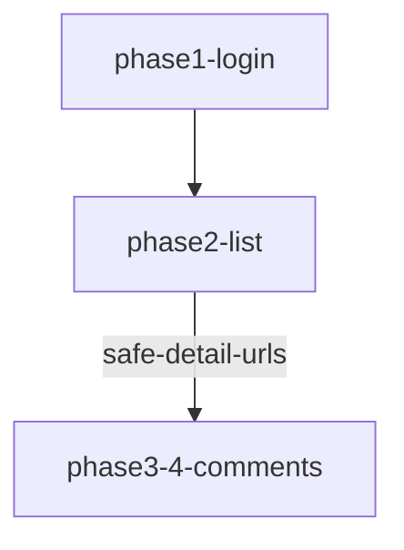

# 小红书 Search 采集模块架构（规划文档）

## 目标

将现有搜索采集脚本拆分为可复用的模块，控制单文件 < 500 行，以“编排 + 复用函数”为主，避免巨型脚本。

## 核心能力

1. **SearchGate 管控**：所有搜索必须走 permit
2. **容器驱动**：容器 + Rect 校验 + 可见性确认
3. **安全搜索**：仅输入框搜索，不构造 URL
4. **可恢复**：失败后可回滚、等待、重试
5. **分层结构**：UI/Workflow/Service 清晰

## 模块分层

```
scripts/xiaohongshu/search/
├── orchestrator.mjs         # 总调度器（小于 200 行）
├── phases/
│   ├── phase1-login.mjs     # 登录态检查 & SearchGate
│   ├── phase2-list.mjs      # 列表采集（safe-detail-urls）
│   └── phase3-4-comments.mjs# 详情 + 评论采集
├── blocks/
│   ├── search-input.mjs     # GoToSearchBlock 封装
│   ├── list-scroll.mjs      # 滚动策略（重试/回滚/等待）
│   ├── open-detail.mjs      # 详情打开 + URL 校验
│   └── collect-comments.mjs # 评论采集封装
└── shared/
    ├── state.mjs            # 状态管理 (.collect-state.json)
    ├── logger.mjs           # 统一日志
    ├── retry.mjs            # 通用重试策略
    ├── daemon.mjs           # 后台执行包装
    └── io.mjs               # 落盘规范（content.md/comments.md）
```

## 编排流程（简化）



## 每阶段职责

### Phase1（登录 + SearchGate）
- 会话检查：`status-v2.mjs`
- SearchGate 拉起 & permit

### Phase2（列表采集）
- 搜索输入框 -> Enter
- 列表容器匹配
- Scroll + 重试 + 回滚
- 落盘 `safe-detail-urls.jsonl`

### Phase3-4（详情 + 评论）
- 从 safe-detail-urls.jsonl 逐条处理
- 打开详情页 -> 抽取正文/图片
- 滚动采集评论 -> 落盘 comments.md

## 约束

- 禁止 URL 直跳（无 xsec_token 一级违规）
- 操作必须在视口内
- SearchGate 节流
- 统一输出到 `~/.webauto/download/xiaohongshu/{env}/{keyword}/`

