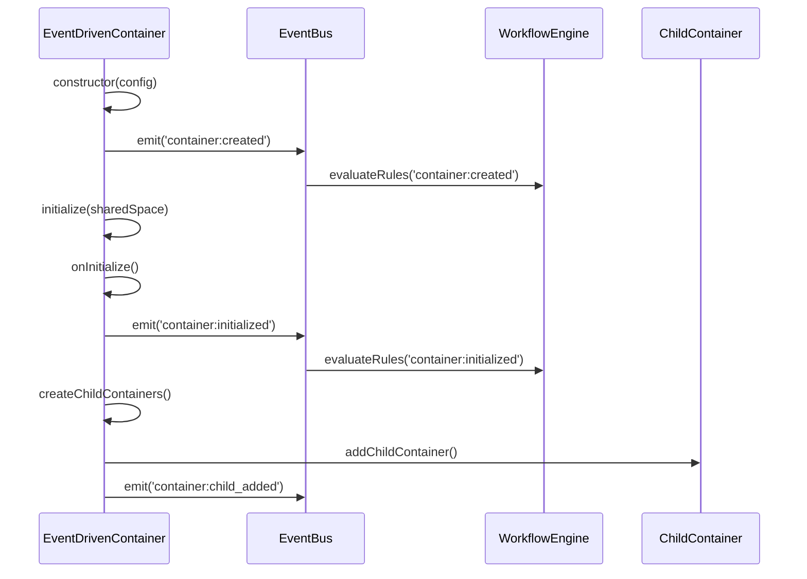
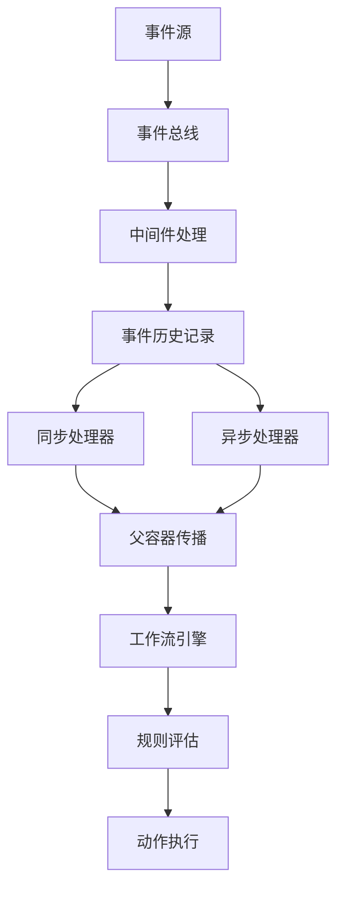

# 事件驱动容器系统架构文档

## 📋 系统概述

本系统是一个完全事件驱动的自动化框架，通过事件总线和工作流引擎实现容器的自驱动和编排。系统采用发布-订阅模式，容器之间通过事件进行通信，而不是直接的方法调用，从而实现了高度解耦和灵活的架构。

## 🏗️ 核心架构

### 1. 事件总线 (EventBus)

事件总线是整个系统的核心通信机制，负责事件的发布、订阅和路由。

```typescript
class EventBus {
  // 事件处理器映射
  private eventHandlers: Map<string, EventHandler[]> = new Map();

  // 中间件支持
  private middleware: EventMiddleware[] = [];

  // 事件历史记录
  private eventHistory: EventHistoryEntry[] = [];

  // 发布事件
  async emit(event: string, data: EventData = {}, source?: string): Promise<void>

  // 订阅事件
  on<T extends EventType>(event: T, handler: EventHandler<T>): void

  // 一次性订阅
  once<T extends EventType>(event: T, handler: EventHandler<T>): void
}
```

**核心特性**：
- **异步事件处理**：所有事件处理都是异步的，不会阻塞主线程
- **中间件支持**：支持事件拦截、修改、增强等功能
- **事件历史**：完整记录所有事件，便于调试和审计
- **错误隔离**：单个事件处理器错误不会影响其他处理器
- **优先级支持**：支持事件处理器的优先级排序

### 2. 事件类型系统 (EventTypes)

系统定义了完整的类型安全事件体系，覆盖容器生命周期的各个阶段。

```typescript
// 容器生命周期事件
const CONTAINER_EVENTS = {
  LIFECYCLE: {
    CREATED: 'container:created',
    INITIALIZED: 'container:initialized',
    STARTED: 'container:started',
    PAUSED: 'container:paused',
    RESUMED: 'container:resumed',
    STOPPED: 'container:stopped',
    DESTROYED: 'container:destroyed'
  },

  // 滚动事件
  SCROLL: {
    STARTED: 'scroll:started',
    STOPPED: 'scroll:stopped',
    BOTTOM_REACHED: 'scroll:bottom_reached',
    PROGRESS: 'scroll:progress',
    NO_NEW_CONTENT: 'scroll:no_new_content'
  },

  // 链接事件
  LINKS: {
    DISCOVERED: 'links:discovered',
    BATCH_DISCOVERED: 'links:batch_discovered',
    TARGET_REACHED: 'links:target_reached',
    EXTRACTION_COMPLETED: 'links:extraction_completed'
  },

  // 分页事件
  PAGINATION: {
    STARTED: 'pagination:started',
    PAGE_LOADED: 'pagination:page_loaded',
    LAST_PAGE_REACHED: 'pagination:last_page_reached',
    STOPPED: 'pagination:stopped'
  },

  // 工作流事件
  WORKFLOW: {
    TASK_READY: 'workflow:task_ready',
    CONDITION_MET: 'workflow:condition_met',
    RULE_TRIGGERED: 'workflow:rule_triggered'
  }
};
```

**事件数据结构**：
每个事件类型都有对应的数据结构，确保类型安全：
```typescript
interface EventDataMap {
  'container:created': { containerId: string; containerType: string; timestamp: number };
  'scroll:bottom_reached': { containerId: string; totalScrollHeight: number; scrollTime: number };
  'links:target_reached': { targetCount: number; actualCount: number };
  'workflow:condition_met': { ruleName: string; eventData: any };
}
```

### 3. 工作流引擎 (WorkflowEngine)

工作流引擎是系统的编排中心，负责基于规则驱动容器的行为。

```typescript
class WorkflowEngine {
  // 规则映射
  private rules: Map<string, WorkflowRule> = new Map();

  // 工作流实例
  private instances: Map<string, WorkflowInstance> = new Map();

  // 事件总线
  private eventBus: EventBus;

  // 评估规则
  private async evaluateRule(rule: WorkflowRule, event: EventType, data: any): Promise<void>

  // 执行动作
  private async executeAction(action: WorkflowAction, context: ExecutionContext): Promise<void>
}
```

**规则定义**：
```typescript
interface WorkflowRule {
  id: string;
  name: string;
  description: string;

  // 触发条件
  trigger: {
    event: EventType;
    conditions?: Condition[];
  };

  // 执行动作
  actions: WorkflowAction[];

  // 优先级
  priority: number;

  // 是否启用
  enabled: boolean;
}
```

### 4. 事件驱动容器基类 (EventDrivenContainer)

所有容器都继承自这个基类，提供统一的生命周期管理和事件处理能力。

```typescript
abstract class EventDrivenContainer {
  protected config: ContainerConfig;
  protected state: ContainerState;
  protected eventBus: EventBus;
  protected childContainers: Map<string, EventDrivenContainer> = new Map();
  protected parentContainer: EventDrivenContainer | null = null;

  // 生命周期方法
  abstract onInitialize(): Promise<void>;
  abstract onStart(): Promise<void>;
  abstract onPause(): Promise<void>;
  abstract onResume(): Promise<void>;
  abstract onStop(): Promise<void>;
  abstract onDestroy(): Promise<void>;

  // 事件处理
  async emit<T extends EventType>(event: T, data: EventDataMap[T]): Promise<void>
  on<T extends EventType>(event: T, handler: EventHandler<T>): void

  // 子容器管理
  addChildContainer(container: EventDrivenContainer): void
  removeChildContainer(containerId: string): void
}
```

## 🔄 事件驱动的工作流程

### 1. 容器初始化流程



### 2. 事件传播机制



### 3. 滚动容器事件驱动流程

```typescript
// 1. 滚动开始
scrollContainer.emit('scroll:started', {
  containerId: 'scroll_1',
  startTime: Date.now()
});

// 2. 滚动进度
scrollContainer.emit('scroll:progress', {
  containerId: 'scroll_1',
  scrollCount: 5,
  scrollHeight: 5000,
  scrollTop: 2000,
  newContentFound: true
});

// 3. 滚动到底部
scrollContainer.emit('scroll:bottom_reached', {
  containerId: 'scroll_1',
  totalScrollHeight: 10000,
  scrollTime: 15000
});

// 4. 触发工作流规则
workflowEngine.evaluateRule({
  trigger: { event: 'scroll:bottom_reached' },
  actions: [
    { type: 'emit', event: 'links:extract' },
    { type: 'start', container: 'pagination' }
  ]
});
```

## 🎯 容器实现示例

### 滚动容器 (EventDrivenScrollContainer)

```typescript
class EventDrivenScrollContainer extends EventDrivenContainer {
  private scrollInterval: NodeJS.Timeout | null = null;
  private isScrolling: boolean = false;

  protected async onInitialize(): Promise<void> {
    this.setupScrollEventHandlers();
    this.scrollMetrics = this.initializeScrollMetrics();
  }

  private async startSmartScrolling(): Promise<void> {
    this.scrollInterval = setInterval(async () => {
      if (!this.isScrolling) return;

      if (this.shouldStopScrolling()) {
        this.stopScrolling('conditions_met');
        return;
      }

      await this.performScrollStep();
      await this.waitForContentLoad();

      // 发射滚动进度事件
      this.emit('scroll:progress', {
        scrollCount: this.scrollMetrics.scrollCount,
        scrollHeight: this.scrollMetrics.scrollHeight,
        newContentFound: this.scrollMetrics.newContentFound
      });
    }, this.config.scrollDelay);
  }

  private setupScrollEventHandlers(): void {
    // 监听内容变化事件
    this.on('content:new_content_loaded', (data) => {
      this.handleNewContentLoaded(data);
    });

    // 监听无新内容事件
    this.on('scroll:no_new_content', (data) => {
      if (data.consecutiveCount >= 5) {
        this.stopScrolling('no_new_content');
      }
    });
  }
}
```

### 链接容器 (EventDrivenLinkContainer)

```typescript
class EventDrivenLinkContainer extends EventDrivenContainer {
  private linkCache: Map<string, LinkData> = new Map();

  private async handleContentChange(): Promise<void> {
    if (this.isRunning()) {
      await this.extractLinks();
    }
  }

  async extractLinks(): Promise<LinkExtractionResult> {
    const links = await this.extractLinksFromPage();
    const result = await this.processExtractedLinks(links);

    // 发射链接发现事件
    if (result.newLinks > 0) {
      this.emit('links:batch_discovered', {
        links: result.links.slice(-result.newLinks),
        totalCount: result.totalCount,
        newLinks: result.newLinks
      });
    }

    // 检查是否达到目标
    if (result.totalCount >= this.config.maxLinks) {
      this.emit('links:target_reached', {
        targetCount: this.config.maxLinks,
        actualCount: result.totalCount
      });
    }

    return result;
  }
}
```

### 页面容器 (EventDrivenPageContainer)

```typescript
class EventDrivenPageContainer extends EventDrivenContainer {
  private linkContainer: EventDrivenLinkContainer | null = null;
  private scrollContainer: EventDrivenScrollContainer | null = null;
  private paginationContainer: EventDrivenPaginationContainer | null = null;

  private async createChildContainers(): Promise<void> {
    // 创建链接容器
    this.linkContainer = new EventDrivenLinkContainer({
      id: 'main_links',
      name: 'Main Link Container',
      selector: '.feed-container',
      maxLinks: 100
    });
    this.addChildContainer(this.linkContainer);

    // 创建滚动容器
    this.scrollContainer = new EventDrivenScrollContainer({
      id: 'main_scroll',
      name: 'Main Scroll Container',
      selector: '.feed-container',
      scrollStrategy: 'smart'
    });
    this.addChildContainer(this.scrollContainer);

    // 创建分页容器
    this.paginationContainer = new EventDrivenPaginationContainer({
      id: 'main_pagination',
      name: 'Main Pagination Container',
      selector: '.pagination-container',
      paginationMode: 'button'
    });
    this.addChildContainer(this.paginationContainer);
  }

  private setupChildContainerEventHandlers(): void {
    // 监听滚动到底部事件
    if (this.scrollContainer) {
      this.scrollContainer.on('scroll:bottom_reached', (data) => {
        this.emit('workflow:condition_met', {
          ruleName: 'scroll_bottom_reached',
          eventData: data
        });
      });
    }

    // 监听链接目标达到事件
    if (this.linkContainer) {
      this.linkContainer.on('links:target_reached', (data) => {
        this.emit('workflow:condition_met', {
          ruleName: 'link_target_reached',
          eventData: data
        });
      });
    }
  }
}
```

## ⚡ 工作流规则示例

### 微博链接获取工作流

```typescript
// 定义工作流规则
const weiboLinkExtractionRule: WorkflowRule = {
  id: 'weibo_link_extraction',
  name: '微博链接获取工作流',
  description: '自动滚动并提取微博链接',

  trigger: {
    event: 'container:initialized',
    conditions: [
      {
        type: 'container_type',
        operator: 'equals',
        value: 'EventDrivenPageContainer'
      }
    ]
  },

  actions: [
    {
      type: 'start',
      target: 'scroll_container',
      delay: 1000
    }
  ],

  priority: 1,
  enabled: true
};

// 滚动到底部规则
const scrollBottomRule: WorkflowRule = {
  id: 'scroll_bottom_processing',
  name: '滚动到底部处理',
  description: '滚动到底部后提取链接并检查分页',

  trigger: {
    event: 'scroll:bottom_reached'
  },

  actions: [
    {
      type: 'emit',
      event: 'links:extract',
      data: { force: true }
    },
    {
      type: 'start',
      target: 'pagination_container',
      delay: 2000
    }
  ],

  priority: 2,
  enabled: true
};

// 链接目标达到规则
const linkTargetRule: WorkflowRule = {
  id: 'link_target_completion',
  name: '链接目标达到',
  description: '达到目标链接数后停止',

  trigger: {
    event: 'links:target_reached'
  },

  actions: [
    {
      type: 'stop',
      target: 'scroll_container'
    },
    {
      type: 'stop',
      target: 'pagination_container'
    },
    {
      type: 'emit',
      event: 'workflow:completed',
      data: { reason: 'link_target_reached' }
    }
  ],

  priority: 3,
  enabled: true
};
```

## 🚀 系统优势

### 1. 高度解耦
- 容器之间通过事件通信，不直接依赖
- 可以独立修改、测试、部署每个容器
- 支持容器的动态添加和移除

### 2. 灵活编排
- 通过工作流规则控制容器行为
- 支持复杂的条件逻辑和动作序列
- 可以动态调整工作流规则

### 3. 可观测性
- 完整的事件历史记录
- 实时状态监控和调试
- 详细的执行统计信息

### 4. 可扩展性
- 易于添加新的容器类型
- 支持自定义事件类型和处理器
- 中间件机制提供扩展点

### 5. 容错性
- 错误隔离，单个容器错误不影响整体
- 自动重试和恢复机制
- 优雅的降级处理

## 🔧 使用示例

### 基本使用

```typescript
// 创建事件总线
const eventBus = new EventBus();

// 创建工作流引擎
const workflowEngine = new WorkflowEngine(eventBus);

// 创建页面容器
const pageContainer = new EventDrivenPageContainer({
  id: 'weibo_page',
  name: 'Weibo Page Container',
  selector: '.feed-container'
});

// 创建共享空间
const sharedSpace: ContainerSharedSpace = {
  eventBus,
  page: browserPage,
  dataStore: new Map(),
  fileHandler: fileHandler,
  config: {},
  monitoring: {}
};

// 初始化容器
await pageContainer.initialize(sharedSpace);

// 启动容器
await pageContainer.start();

// 添加工作流规则
workflowEngine.addRule(weiboLinkExtractionRule);
workflowEngine.addRule(scrollBottomRule);
workflowEngine.addRule(linkTargetRule);
```

### 监控和调试

```typescript
// 监听所有事件
eventBus.on('*', (event, data, source) => {
  console.log(`[${source}] ${event}:`, data);
});

// 监听特定容器事件
pageContainer.on('links:batch_discovered', (data) => {
  console.log(`发现 ${data.newLinks} 个新链接，总计 ${data.totalCount} 个`);
});

// 获取容器状态
const state = pageContainer.getState();
console.log('容器状态:', state.status);

// 获取执行结果
const result = pageContainer.getExecutionResult();
console.log('执行结果:', result);
```

## 📊 性能特性

### 1. 异步处理
- 所有事件处理都是异步的，不会阻塞主线程
- 支持并发处理多个事件

### 2. 内存管理
- 事件历史自动清理，避免内存泄漏
- 容器生命周期管理，及时释放资源

### 3. 批量处理
- 支持事件的批量处理和合并
- 减少频繁的事件触发开销

## 🔮 未来扩展

### 1. 分布式支持
- 支持跨进程的事件通信
- 分布式工作流编排

### 2. 持久化
- 事件持久化到数据库
- 工作流状态持久化

### 3. 可视化
- 工作流可视化编辑器
- 实时事件流监控

### 4. AI驱动
- 智能工作流优化
- 自适应规则调整

---

*这个事件驱动容器系统提供了一个强大、灵活、可扩展的自动化框架，通过事件驱动的方式实现了容器之间的协调和编排。*