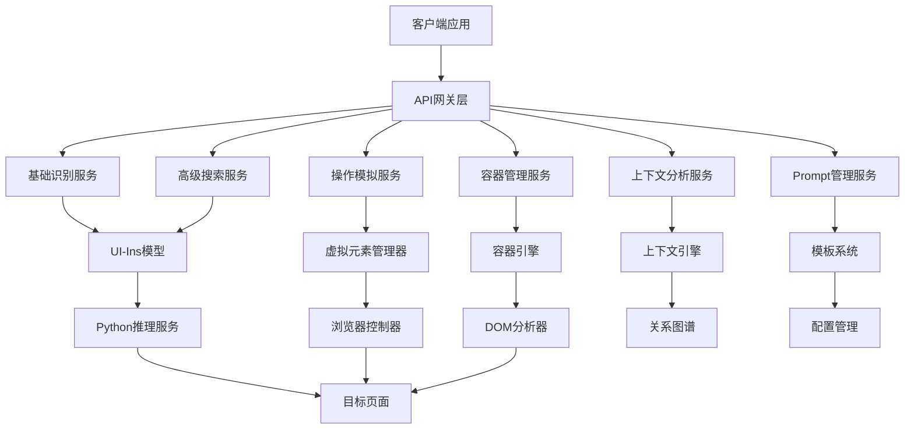
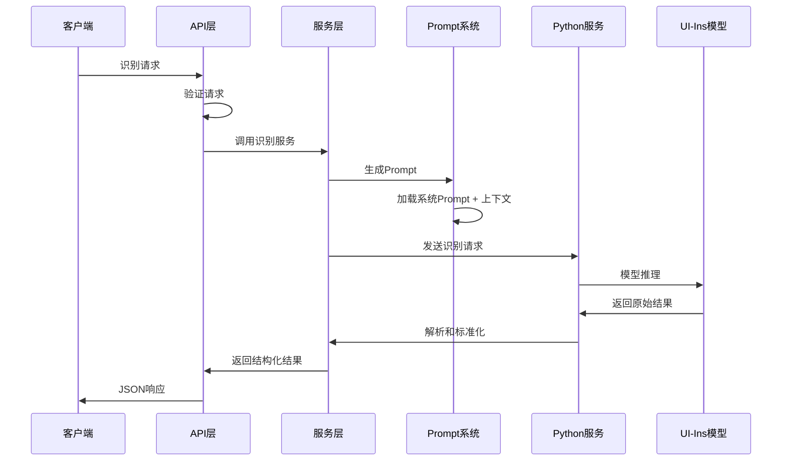
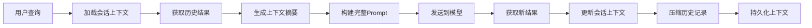

# UI识别模块架构文档

## 概述

基于通义UI-Ins模型的企业级UI识别系统，支持网页、移动应用和桌面应用的界面元素识别、操作模拟和上下文理解。

## 系统架构

### 整体架构图



### 核心组件

#### 1. API层 (src/api/)
负责对外提供RESTful API接口，处理HTTP请求和响应。

**文件结构：**
```
src/api/
├── index.ts                 # API路由主入口
├── routes/                  # API路由定义
│   ├── recognition.ts       # 基础识别API
│   ├── search.ts           # 搜索API
│   ├── action.ts           # 操作模拟API
│   ├── container.ts        # 容器管理API
│   ├── context.ts          # 上下文分析API
│   ├── prompt.ts           # Prompt管理API
│   └── health.ts           # 健康检查API
├── controllers/            # API控制器
└── middleware/             # 中间件
```

**关键特性：**
- 统一的错误处理
- 请求验证和限流
- CORS支持
- 请求日志记录

#### 2. 服务层 (src/services/)
核心业务逻辑实现，包含6个主要服务。

##### 基础识别服务 (recognition/)
- **功能**: 基于AI模型的UI元素识别
- **输入**: 图片、查询参数、上下文信息
- **输出**: 标准化的UI元素列表
- **特点**: AJV Schema验证、智能分类、置信度评估

##### 高级搜索服务 (search/)
- **功能**: 多模态元素搜索
- **搜索类型**: 文本搜索、图片搜索、相似性搜索、模糊搜索
- **特点**: 智能排序、相关性评分、建议系统

##### 操作模拟服务 (action/)
- **功能**: UI操作的模拟和执行
- **操作类型**: 鼠标操作、键盘操作、手势操作
- **特点**: 虚拟元素管理、事件绑定、操作链

##### 容器管理服务 (container/)
- **功能**: UI容器的识别和管理
- **分析维度**: 层级关系、空间布局、语义分析
- **特点**: 相对定位、嵌套逻辑、容器操作

##### 上下文分析服务 (context/)
- **功能**: 页面上下文的理解和分析
- **分析内容**: 页面类型、用户流程、关系图谱、意图预测
- **特点**: 场景理解、预测分析、智能推荐

##### 集成服务 (integration/)
- **功能**: 与现有系统的集成
- **支持系统**: Playwright、Selenium、Appium、网页识别系统
- **特点**: 标准接口、事件驱动、配置管理

#### 3. 核心基础设施 (src/core/)

##### 配置管理 (config.ts)
```typescript
interface UIRecognitionConfig {
  modelService: {
    maxTokens: 8192;        // 8K tokens
    temperature: 0.1;
    timeout: 30000;
  };
  context: {
    maxHistoryLength: 20;
    contextWindowSize: 10;
    sessionTimeout: 1800000;
  };
  prompts: {
    systemPromptsPath: string;
    templatePath: string;
  };
}
```

##### Prompt系统 (prompt-system.ts)
- **系统Prompt**: 基础UI分析指导
- **功能Prompt**: 特定任务的专业指导
- **上下文Prompt**: 会话历史和上下文信息
- **管理API**: 动态设置和更新系统提示词

##### 事件总线 (event-bus.ts)
```typescript
interface RecognitionEvents {
  'recognition.start': RecognitionStartEvent;
  'recognition.complete': RecognitionCompleteEvent;
  'element.found': ElementFoundEvent;
  'container.identified': ContainerIdentifiedEvent;
  'action.suggested': ActionSuggestedEvent;
}
```

#### 4. Python模型服务 (python-service/)

##### 本地模型服务器 (local_model_server.py)
- **模型支持**: UI-Ins-7B、UI-Ins-32B
- **硬件加速**: MPS (Mac)、CUDA (GPU)、CPU
- **特性**: 自动降级、在线回退、坐标解析

**关键配置：**
```python
# 8K tokens默认配置
max_new_tokens=request.parameters.get('max_tokens', 8192)

# 支持多种坐标格式
coord_patterns = [
    r'\[(\d+)\s*,\s*(\d+)\s*,\s*(\d+)\s*,\s*(\d+)\]',  # 边界框
    r'coordinates?\s*\[?\s*(\d+)\s*,\s*(\d+)\s*\]?',      # 单点
]
```

## 数据流架构

### 请求处理流程



### 上下文管理流程



## API设计

### 基础识别API
```typescript
POST /api/recognition/recognize
{
  "image": "base64...",
  "query": "找到登录按钮",
  "sessionId": "user-session-123",
  "contextType": "web",
  "parameters": {
    "maxTokens": 8192,
    "temperature": 0.1
  }
}
```

### 系统Prompt管理API
```typescript
POST /api/prompt/system
{
  "uiAnalysis": "You are a UI analysis assistant...",
  "webSpecific": "When analyzing web interfaces...",
  "appSpecific": "When analyzing native apps...",
  "searchSpecific": "When searching for elements...",
  "actionSpecific": "When suggesting actions..."
}
```

### 响应格式
```typescript
{
  "success": true,
  "sessionId": "user-session-123",
  "elements": [
    {
      "id": "element-1",
      "type": "button",
      "bbox": [100, 50, 200, 90],
      "confidence": 0.95,
      "text": "Login",
      "description": "Primary login button"
    }
  ],
  "actions": [
    {
      "type": "click",
      "target": { "bbox": [100, 50, 200, 90] },
      "reason": "Click login button to proceed"
    }
  ],
  "contextUpdated": true,
  "processingTime": 1250
}
```

## 配置系统

### 环境变量配置 (.env)
```bash
# 服务配置
PORT=7007
HOST=localhost

# 模型配置
MAX_TOKENS=8192
TEMPERATURE=0.1
MODEL_SERVICE_URL=http://localhost:8898

# 上下文管理
CONTEXT_WINDOW_SIZE=10
SESSION_TIMEOUT=1800000

# 系统提示词
SYSTEM_PROMPTS_PATH=./config/system-prompts.json
```

### 系统提示词配置 (system-prompts.json)
```json
{
  "uiAnalysis": "You are a specialized UI analysis assistant...",
  "webSpecific": "When analyzing web interfaces...",
  "appSpecific": "When analyzing native app interfaces...",
  "searchSpecific": "When searching for elements...",
  "actionSpecific": "When suggesting actions...",
  "lastUpdated": "2025-11-02T10:00:00Z",
  "version": "1.0.0"
}
```

## 部署架构

### 开发环境
```yaml
services:
  ui-recognition-api:
    build: .
    ports:
      - "7007:7007"
    environment:
      - NODE_ENV=development
      - MODEL_SERVICE_URL=http://python-service:8898
    depends_on:
      - python-service

  python-service:
    build: ./python-service
    ports:
      - "8898:8898"
    volumes:
      - ./models:/app/models
    environment:
      - MODEL_PATH=/app/models/ui-ins-7b
```

### 生产环境
- **负载均衡**: Nginx + 多实例API服务
- **模型服务**: 独立的高性能GPU服务器
- **缓存**: Redis层用于会话和结果缓存
- **监控**: Prometheus + Grafana监控
- **日志**: ELK Stack日志聚合

## 性能优化

### 模型优化
- **量化**: INT8量化减少内存占用
- **批处理**: 支持批量图片处理
- **缓存**: 常用页面识别结果缓存
- **预热**: 模型预加载减少延迟

### API优化
- **连接池**: HTTP客户端连接复用
- **压缩**: 响应数据gzip压缩
- **限流**: 智能限流保护服务质量
- **缓存**: Redis缓存热点数据

### 上下文优化
- **压缩**: 智能上下文压缩算法
- **窗口**: 滑动窗口管理历史记录
- **摘要**: 自动生成上下文摘要
- **持久化**: 定期保存会话状态

## 安全机制

### 输入安全
- **验证**: 严格的输入参数验证
- **清理**: 敏感信息自动过滤
- **限制**: 文件大小和类型限制
- **扫描**: 恶意内容检测

### 访问控制
- **认证**: JWT Token认证
- **授权**: 基于角色的权限控制
- **限流**: API调用频率限制
- **审计**: 完整的操作审计日志

### 数据保护
- **加密**: 传输和存储数据加密
- **隔离**: 多租户数据隔离
- **备份**: 定期数据备份
- **清理**: 自动数据清理机制

## 监控和运维

### 性能监控
- **响应时间**: 各服务的响应时间监控
- **吞吐量**: 请求处理能力监控
- **错误率**: 服务错误率统计
- **资源使用**: CPU、内存、GPU使用率

### 业务监控
- **识别准确率**: AI模型识别准确率
- **操作成功率**: 自动化操作成功率
- **用户满意度**: 基于反馈的质量评估
- **功能使用**: 各功能模块使用统计

### 告警机制
- **阈值告警**: 性能指标超阈值告警
- **异常告警**: 服务异常自动告警
- **容量告警**: 资源容量预警
- **业务告警**: 业务指标异常告警

## 扩展性设计

### 水平扩展
- **无状态**: API服务完全无状态
- **负载均衡**: 支持多实例负载均衡
- **数据库**: 支持数据库分片
- **缓存**: 分布式缓存支持

### 功能扩展
- **插件**: 支持自定义插件开发
- **模型**: 支持多模型热切换
- **协议**: 支持多种通信协议
- **集成**: 丰富的第三方系统集成接口

### 版本管理
- **兼容**: API版本向后兼容
- **迁移**: 平滑版本迁移机制
- **回滚**: 快速回滚能力
- **测试**: 完整的版本测试流程

---

## 版本历史

### v1.0.0 (当前版本)
- ✅ 基础UI识别功能
- ✅ 高级搜索服务
- ✅ 操作模拟功能
- ✅ 容器管理系统
- ✅ 上下文分析能力
- ✅ Prompt管理系统
- ✅ 8K tokens支持
- ✅ 系统提示词API
- ✅ 默认端口7007

### 未来计划
- 🔄 UI-Ins-32B模型集成
- 🔄 多模态识别增强
- 🔄 实时协作支持
- 🔄 移动端SDK
- 🔄 云原生部署

---

*此文档随系统演进持续更新，最后更新时间: 2025-11-02*
