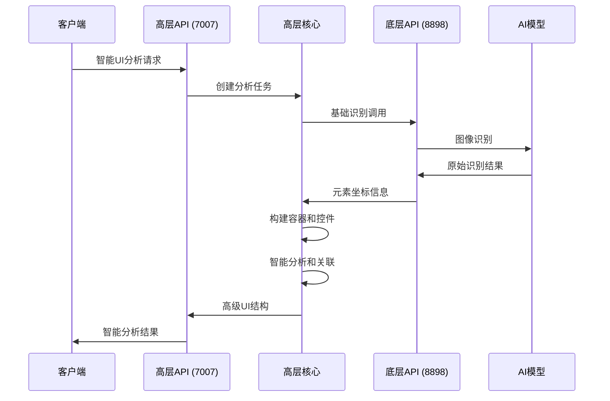

# UI识别模块双层架构设计

## 架构概述

采用双层架构设计，分离底层的UI识别功能和高层UI控件系统：

```
┌─────────────────────────────────────────────────────────┐
│                   高层UI容器系统 (Port 7007)              │
│  现代化UI控件系统 | 应用层感知 | 智能操作 | 对外接口      │
└─────────────────────┬───────────────────────────────────┘
                      │ API调用
┌─────────────────────┴───────────────────────────────────┐
│                底层识别服务 (Port 8898)                  │
│   图像处理 | AI识别 | 坐标解析 | 纯功能API               │
└─────────────────────────────────────────────────────────┘
```

## 第一层：底层识别服务 (Layer 1)

### 职责
- 纯粹的UI图像识别功能
- 与图像打交道的低层处理
- 提供基础的识别坐标和元素信息
- 无业务逻辑，只负责识别

### 目录结构
```
ui-recognition/
├── recognition-service/          # 底层识别服务
│   ├── python-service/           # Python AI模型服务
│   │   ├── local_model_server.py # 模型服务器 (Port 8898)
│   │   ├── models/               # 模型文件
│   │   └── requirements.txt
│   ├── src/                      # NodeJS封装层
│   │   ├── api/                  # 基础识别API
│   │   │   ├── routes/
│   │   │   │   ├── recognize.ts   # 基础识别
│   │   │   │   ├── search.ts      # 元素搜索
│   │   │   │   └── health.ts      # 健康检查
│   │   │   └── index.ts
│   │   ├── core/                 # 核心功能
│   │   │   ├── model-client.ts    # 模型客户端
│   │   │   ├── image-processor.ts # 图像处理
│   │   │   └── coordinate-parser.ts # 坐标解析
│   │   └── types/                 # 类型定义
│   │       ├── recognition.ts
│   │       └── element.ts
│   ├── package.json
│   └── tsconfig.json
```

### API设计 (Port 8898)
```typescript
// 基础识别API - 只返回原始识别结果
POST /recognize
{
  "image": "base64...",
  "query": "找到登录按钮",
  "parameters": {
    "maxTokens": 8192,
    "temperature": 0.1
  }
}

// 响应 - 纯粹的识别结果
{
  "success": true,
  "elements": [
    {
      "id": "elem-1",
      "type": "button",
      "bbox": [100, 50, 200, 90],
      "confidence": 0.95,
      "text": "Login",
      "raw_description": "识别到的登录按钮"
    }
  ],
  "processing_time": 1250
}
```

## 第二层：高层UI容器系统 (Layer 2)

### 职责
- 现代化的UI控件系统
- 应用层级的智能感知
- 嵌套容器关联管理
- 控件操作封装
- 对外提供所有高级接口

### 目录结构
```
ui-recognition/
├── ui-container-system/           # 高层UI容器系统
│   ├── src/
│   │   ├── api/                   # 对外API接口 (Port 7007)
│   │   │   ├── routes/
│   │   │   │   ├── ui-analysis.ts  # UI分析接口
│   │   │   │   ├── container.ts    # 容器管理接口
│   │   │   │   ├── control.ts      # 控件操作接口
│   │   │   │   ├── automation.ts   # 自动化接口
│   │   │   │   └── health.ts       # 健康检查
│   │   │   ├── controllers/        # 控制器
│   │   │   └── index.ts
│   │   │
│   │   ├── core/                   # 核心UI系统
│   │   │   ├── ui-container.ts     # UI容器基类
│   │   │   ├── ui-control.ts       # UI控件基类
│   │   │   ├── container-builder.ts # 容器构建器
│   │   │   ├── relationship-manager.ts # 关系管理器
│   │   │   └── operation-engine.ts # 操作引擎
│   │   │
│   │   ├── containers/             # 容器类型实现
│   │   │   ├── page-container.ts   # 页面容器
│   │   │   ├── form-container.ts   # 表单容器
│   │   │   ├── menu-container.ts   # 菜单容器
│   │   │   ├── table-container.ts  # 表格容器
│   │   │   └── modal-container.ts  # 模态框容器
│   │   │
│   │   ├── controls/               # 控件类型实现
│   │   │   ├── button-control.ts   # 按钮控件
│   │   │   ├── input-control.ts    # 输入控件
│   │   │   ├── link-control.ts     # 链接控件
│   │   │   ├── select-control.ts   # 选择控件
│   │   │   └── checkbox-control.ts # 复选框控件
│   │   │
│   │   ├── operations/             # 操作实现
│   │   │   ├── click-operation.ts  # 点击操作
│   │   │   ├── type-operation.ts   # 输入操作
│   │   │   ├── select-operation.ts # 选择操作
│   │   │   └── hover-operation.ts  # 悬停操作
│   │   │
│   │   ├── intelligence/           # 智能分析
│   │   │   ├── context-analyzer.ts # 上下文分析
│   │   │   ├── pattern-detector.ts # 模式检测
│   │   │   ├── intent-predictor.ts # 意图预测
│   │   │   └── smart-suggestions.ts # 智能建议
│   │   │
│   │   ├── services/               # 服务层
│   │   │   ├── recognition-client.ts # 识别服务客户端
│   │   │   ├── cache-service.ts    # 缓存服务
│   │   │   ├── session-service.ts  # 会话服务
│   │   │   └── config-service.ts   # 配置服务
│   │   │
│   │   └── types/                  # 类型定义
│   │       ├── container.ts
│   │       ├── control.ts
│   │       ├── operation.ts
│   │       └── intelligence.ts
│   │
│   ├── package.json
│   ├── tsconfig.json
│   └── .env.example
```

### 核心类设计

#### UI容器基类
```typescript
abstract class UIContainer {
  id: string;
  type: ContainerType;
  bounds: BoundingBox;
  children: UIControl[];
  parent?: UIContainer;
  relationships: ContainerRelationship[];

  // 容器操作
  abstract analyzeIntelligence(): Promise<ContainerAnalysis>;
  abstract getSuggestedActions(): ActionSuggestion[];
  abstract getChildControls(): UIControl[];

  // 关系管理
  addRelationship(container: UIContainer, type: RelationshipType): void;
  findRelatedContainers(type?: RelationshipType): UIContainer[];
}
```

#### UI控件基类
```typescript
abstract class UIControl {
  id: string;
  type: ControlType;
  bounds: BoundingBox;
  container: UIContainer;
  properties: ControlProperties;
  operations: Operation[];

  // 控件操作
  abstract getAvailableOperations(): Operation[];
  abstract executeOperation(operation: Operation, params?: any): Promise<OperationResult>;
  abstract validateOperation(operation: Operation): boolean;

  // 智能分析
  abstract getPurpose(): string;
  abstract getInteractions(): InteractionPattern[];
}
```

#### 操作引擎
```typescript
class OperationEngine {
  // 执行控件操作
  async executeControlOperation(
    control: UIControl,
    operation: Operation,
    params?: any
  ): Promise<OperationResult>;

  // 批量操作
  async executeBatchOperations(
    operations: OperationBatch[]
  ): Promise<OperationResult[]>;

  // 操作链
  async executeOperationChain(
    chain: OperationChain
  ): Promise<ChainResult>;
}
```

### 高级API设计 (Port 7007)

#### UI分析接口
```typescript
POST /api/ui/analysis
{
  "image": "base64...",
  "analysisLevel": "deep", // "basic" | "deep" | "comprehensive"
  "context": {
    "userIntent": "登录系统",
    "previousActions": ["打开页面"]
  }
}

// 响应 - 高级分析结果
{
  "success": true,
  "pageAnalysis": {
    "pageType": "login-page",
    "mainContainers": [
      {
        "id": "container-1",
        "type": "login-form",
        "purpose": "用户认证",
        "controls": [
          {
            "id": "control-1",
            "type": "input",
            "label": "用户名",
            "purpose": "输入用户名",
            "operations": ["type", "clear", "focus"],
            "suggestedActions": ["输入用户名", "验证格式"]
          }
        ]
      }
    ],
    "intelligentSuggestions": [
      {
        "action": "fill-form",
        "description": "自动填充登录表单",
        "confidence": 0.92,
        "steps": ["输入用户名", "输入密码", "点击登录"]
      }
    ]
  }
}
```

#### 容器管理接口
```typescript
POST /api/container/analyze
{
  "image": "base64...",
  "containerType": "auto-detect"
}

GET /api/container/{containerId}/controls
POST /api/container/{containerId}/operation
```

#### 控件操作接口
```typescript
POST /api/control/{controlId}/execute
{
  "operation": "click",
  "parameters": {
    "button": "left",
    "modifiers": ["ctrl"]
  }
}

// 智能操作
POST /api/control/smart-operation
{
  "intent": "登录",
  "context": "当前在登录页面"
}
```

## 系统交互流程



## 容器关联系统

### 嵌套关系
```typescript
interface ContainerNesting {
  parent: UIContainer;
  children: UIContainer[];
  depth: number;
  layoutType: 'vertical' | 'horizontal' | 'grid' | 'flex';
}
```

### 功能关联
```typescript
interface FunctionalRelationship {
  source: UIContainer;
  target: UIContainer;
  type: 'form-submit' | 'navigation-target' | 'data-source' | 'action-trigger';
  strength: number; // 0-1
  conditions?: RelationshipCondition[];
}
```

### 空间关系
```typescript
interface SpatialRelationship {
  container1: UIContainer;
  container2: UIContainer;
  relationship: 'above' | 'below' | 'left' | 'right' | 'inside' | 'nearby';
  distance: number;
  alignment: 'start' | 'center' | 'end';
}
```

## 智能操作封装

### 按钮控件操作
```typescript
class ButtonControl extends UIControl {
  getAvailableOperations(): Operation[] {
    return [
      new ClickOperation(),
      new RightClickOperation(),
      new DoubleClickOperation(),
      new HoverOperation(),
      new FocusOperation()
    ];
  }

  // 智能点击
  async smartClick(params?: SmartClickParams): Promise<OperationResult> {
    // 自动判断点击方式、等待时间、预期结果
  }
}
```

### 输入控件操作
```typescript
class InputControl extends UIControl {
  getAvailableOperations(): Operation[] {
    return [
      new TypeOperation(),
      new ClearOperation(),
      new SelectAllOperation(),
      new PasteOperation(),
      new ValidateOperation()
    ];
  }

  // 智能输入
  async smartType(text: string, options?: SmartTypeOptions): Promise<OperationResult> {
    // 自动清空、输入、验证、格式化
  }
}
```

## 配置和部署

### 开发环境
```yaml
services:
  # 底层识别服务
  recognition-service:
    build: ./recognition-service
    ports:
      - "8898:8898"
    environment:
      - MODEL_SERVICE_URL=http://localhost:8898
      - PORT=8898

  # 高层UI容器系统
  ui-container-system:
    build: ./ui-container-system
    ports:
      - "7007:7007"
    environment:
      - RECOGNITION_SERVICE_URL=http://recognition-service:8898
      - PORT=7007
    depends_on:
      - recognition-service
```

### 生产环境
- **负载均衡**: 高层API支持水平扩展
- **模型集群**: 底层服务支持多实例
- **缓存层**: Redis缓存分析结果
- **监控**: 双层服务监控

## 优势

1. **职责分离**: 底层专注识别，高层专注应用
2. **可扩展性**: 两层都可以独立扩展
3. **复用性**: 底层服务可被多个高层系统复用
4. **现代化**: 高层提供现代化的UI控件抽象
5. **智能化**: 高层集成智能分析和操作建议

---

*此架构设计实现了纯粹的功能识别与现代化UI控件系统的完美分离*