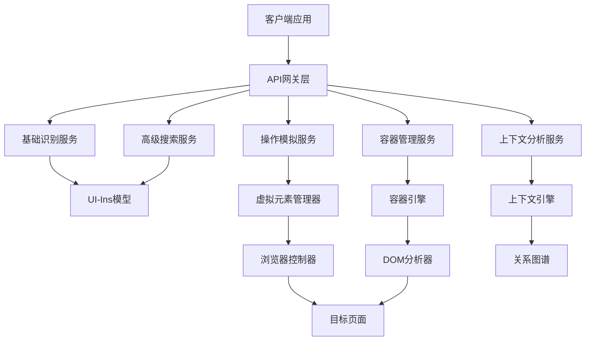
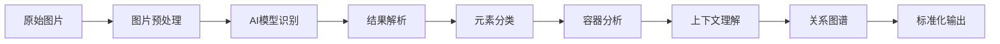

# UI识别系统架构设计文档

## 概述

基于现有的UI识别模型，设计一个完整的、可扩展的UI识别和自动化系统，支持基础识别、高级搜索、操作模拟、容器管理和上下文关联等功能。

## 系统架构设计



## 1. 基础识别服务 (Basic Recognition Service)

### 1.1 核心功能
- **图片标准化处理**: 支持多种图片格式输入
- **全局UI识别**: 基于AI模型的完整页面分析
- **Schema标准化**: AJV规范的JSON Schema输出
- **元素分类**: 智能元素类型识别和分类

### 1.2 API设计

```typescript
interface BasicRecognitionRequest {
  image: string;           // base64图片数据
  contextType: 'web' | 'mobile' | 'desktop'; // 输入类型
  standardization: boolean; // 是否启用标准化
  parameters?: RecognitionParameters;
}

interface RecognitionParameters {
  temperature?: number;
  maxTokens?: number;
  includeCoordinates?: boolean;
  confidenceThreshold?: number;
}

interface BasicRecognitionResponse {
  success: boolean;
  requestId: string;
  elements: UIElement[];
  metadata: RecognitionMetadata;
  schema: JSONSchema;
  confidence: number;
  processingTime: number;
}

interface UIElement {
  id: string;
  type: ElementType;
  bbox: BoundingBox;
  confidence: number;
  text?: string;
  description: string;
  attributes: ElementAttributes;
  container?: string;
  context?: ElementContext;
}

type ElementType =
  | 'button' | 'input' | 'textarea' | 'select' | 'checkbox' | 'radio'
  | 'link' | 'image' | 'video' | 'audio' | 'canvas'
  | 'menu' | 'navigation' | 'header' | 'footer' | 'sidebar'
  | 'table' | 'list' | 'form' | 'div' | 'span'
  | 'unknown';
```

### 1.3 元素分类策略

#### 网页元素分类
```javascript
const webElementTypes = {
  // 输入类
  textInput: ['input[type="text"]', 'input:not([type])', 'textarea'],
  passwordInput: ['input[type="password"]'],
  emailInput: ['input[type="email"]'],
  searchInput: ['input[type="search"]', '[role="searchbox"]'],
  numberInput: ['input[type="number"]'],
  fileInput: ['input[type="file"]'],

  // 按钮类
  button: ['button', 'input[type="button"]', '[role="button"]'],
  submitButton: ['input[type="submit"]', 'button[type="submit"]'],
  resetButton: ['input[type="reset"]', 'button[type="reset"]'],

  // 导航类
  link: ['a[href]'],
  navigation: ['nav', '[role="navigation"]'],
  menu: ['menu', '[role="menu"]'],
  menuItem: ['menuitem', '[role="menuitem"]'],

  // 媒体类
  image: ['img'],
  video: ['video'],
  audio: ['audio'],
  canvas: ['canvas'],

  // 结构类
  header: ['header', '[role="banner"]'],
  footer: ['footer', '[role="contentinfo"]'],
  main: ['main', '[role="main"]'],
  section: ['section', '[role="region"]'],
  article: ['article', '[role="article"]'],
  aside: ['aside', '[role="complementary"]']
};
```

#### 应用元素分类
```javascript
const appElementTypes = {
  // 移动应用特有
  nativeButton: ['android.widget.Button', 'UIButton'],
  nativeInput: ['android.widget.EditText', 'UITextField'],
  nativeSwitch: ['android.widget.Switch', 'UISwitch'],
  nativeSlider: ['android.widget.SeekBar', 'UISlider'],

  // 桌面应用特有
  windowButton: ['[role="button"]', '.btn'],
  windowInput: ['[role="textbox"]', '.input'],
  windowTabControl: ['.tab', '[role="tab"]'],

  // 游戏应用特有
  gameButton: ['.game-button', '[data-game-action]'],
  gameCanvas: ['#game-canvas', '[role="application"]']
};
```

## 2. 高级搜索服务 (Advanced Search Service)

### 2.1 核心功能
- **文本搜索**: 基于文本内容的元素查找
- **图片搜索**: 基于图片特征的元素匹配
- **相似性搜索**: 基于视觉相似度的元素查找
- **模糊搜索**: 支持部分匹配和容错搜索

### 2.2 API设计

```typescript
interface SearchRequest {
  image?: string;          // 基础图片（可选）
  searchText?: string;       // 文本搜索查询
  referenceImage?: string;    // 参考图片（图片搜索）
  searchType: 'text' | 'image' | 'similarity' | 'fuzzy';
  filters?: SearchFilters;
  ranking?: SearchRanking;
}

interface SearchFilters {
  elementTypes?: ElementType[];
  confidence?: { min?: number; max?: number };
  area?: BoundingBox;
  excludeTypes?: ElementType[];
  requireText?: boolean;
}

interface SearchRanking {
  sortBy: 'confidence' | 'area' | 'position' | 'relevance';
  order: 'asc' | 'desc';
  limit?: number;
}

interface SearchResponse {
  success: boolean;
  matches: MatchedElement[];
  totalCount: number;
  searchTime: number;
  suggestions?: string[];
}

interface MatchedElement extends UIElement {
  matchScore: number;
  matchReason: string;
  similarity?: number;
}
```

## 3. 操作模拟服务 (Action Simulation Service)

### 3.1 核心功能
- **鼠标操作**: 点击、双击、右键、拖拽、悬停
- **键盘操作**: 文本输入、组合键、特殊键
- **手势操作**: 滑动、缩放、旋转
- **操作链**: 复杂操作的序列化执行

### 3.2 API设计

```typescript
interface ActionRequest {
  target: ElementTarget;
  actionType: ActionType;
  parameters?: ActionParameters;
  options?: ActionOptions;
}

interface ElementTarget {
  selector?: string;       // CSS选择器
  coordinates?: [number, number]; // 坐标
  text?: string;           // 文本内容
  elementId?: string;      // 元素ID
  virtualId?: string;       // 虚拟元素ID
}

type ActionType =
  | 'click' | 'doubleClick' | 'rightClick' | 'hover'
  | 'type' | 'clear' | 'select'
  | 'scroll' | 'drag' | 'drop'
  | 'keyPress' | 'keyDown' | 'keyUp'
  | 'gesture' | 'swipe' | 'pinch' | 'zoom';

interface ActionParameters {
  // 鼠标参数
  button?: 'left' | 'right' | 'middle';
  modifiers?: ('ctrl' | 'shift' | 'alt' | 'meta')[];

  // 键盘参数
  key?: string;
  text?: string;

  // 拖拽参数
  dragTo?: [number, number];
  dropTarget?: string;

  // 滚动参数
  direction?: 'up' | 'down' | 'left' | 'right';
  distance?: number;
  speed?: number;

  // 缩放参数
  scale?: number;
  center?: [number, number];
}
```

### 3.3 虚拟元素管理

```typescript
interface VirtualElement {
  id: string;
  type: 'virtual' | 'overlay' | 'synthetic';
  bounds: BoundingBox;
  behavior: VirtualBehavior;
  interactions: InteractionRule[];
  bindings: ElementBinding[];
}

interface VirtualBehavior {
  hover?: HoverBehavior;
  click?: ClickBehavior;
  focus?: FocusBehavior;
  drag?: DragBehavior;
}

interface ElementBinding {
  eventType: string;
  sourceElement: string;
  targetElement: string;
  mapping: EventMapping;
}
```

## 4. 容器管理服务 (Container Management Service)

### 4.1 核心功能
- **容器识别**: 自动识别UI元素的容器结构
- **嵌套关系**: 建立元素间的层级关系
- **相对定位**: 计算容器内元素的相对位置
- **容器操作**: 容器级别的操作和属性管理

### 4.2 API设计

```typescript
interface ContainerAnalysisRequest {
  elements: UIElement[];
  analysisMode: 'auto' | 'hierarchy' | 'spatial' | 'semantic';
  options?: ContainerAnalysisOptions;
}

interface ContainerAnalysisResponse {
  containers: Container[];
  relationships: ElementRelationship[];
  hierarchy: ElementHierarchy;
  spatialLayout: SpatialLayout;
}

interface Container {
  id: string;
  type: ContainerType;
  bounds: BoundingBox;
  children: string[];
  parent?: string;
  attributes: ContainerAttributes;
  semantics?: ContainerSemantics;
}

type ContainerType =
  | 'layout' | 'group' | 'list' | 'table' | 'form'
  | 'modal' | 'dropdown' | 'menu' | 'sidebar' | 'content'
  | 'header' | 'footer' | 'section' | 'article' | 'aside'
  | 'custom';

interface ElementRelationship {
  sourceId: string;
  targetId: string;
  type: RelationshipType;
  strength: number;
  properties: RelationshipProperties;
}

type RelationshipType =
  | 'parent' | 'child' | 'sibling'
  | 'adjacent' | 'nearby' | 'overlapping'
  | 'containing' | 'contained' | 'relative';
```

### 4.3 容器引擎设计

```typescript
class ContainerEngine {
  // 容器识别算法
  identifyContainers(elements: UIElement[]): Container[];

  // 层级关系构建
  buildHierarchy(containers: Container[]): ElementHierarchy;

  // 空间布局分析
  analyzeSpatialLayout(elements: UIElement[]): SpatialLayout;

  // 语义分析
  analyzeSemantics(elements: UIElement[], context: any): ContainerSemantics;

  // 相对位置计算
  calculateRelativePositions(element: UIElement, container: Container): RelativePosition;
}
```

## 5. 上下文分析服务 (Context Analysis Service)

### 5.1 核心功能
- **上下文识别**: 识别页面和应用的整体上下文
- **关系图谱**: 构建元素间的关系网络
- **场景理解**: 理解当前用户界面所处的场景
- **预测分析**: 预测用户的下一步操作意图

### 5.2 API设计

```typescript
interface ContextAnalysisRequest {
  elements: UIElement[];
  containers: Container[];
  previousContext?: ContextState;
  userIntent?: UserIntent;
  options?: ContextAnalysisOptions;
}

interface ContextAnalysisResponse {
  context: ContextState;
  relationships: RelationshipGraph;
  scenes: Scene[];
  predictions: ActionPrediction[];
  insights: ContextInsight[];
}

interface ContextState {
  pageType: PageType;
  userFlowStage: UserFlowStage;
  currentFocus?: string;
  recentActions: ActionHistory[];
  environmentInfo: EnvironmentInfo;
}

interface RelationshipGraph {
  nodes: GraphNode[];
  edges: GraphEdge[];
  clusters: GraphCluster[];
  centrality: CentralityMetrics;
}

interface ActionPrediction {
  action: ActionType;
  target: ElementTarget;
  probability: number;
  reasoning: string;
  alternatives?: ActionAlternative[];
}
```

## 6. 扩展接口设计

### 6.1 网页识别系统集成

```typescript
interface WebRecognitionExtension {
  // 与现有网页识别系统集成
  integrateWithWebRecognition(webRecognitionConfig: WebRecognitionConfig): void;

  // 数据同步
  syncWithWebRecognition(elements: UIElement[]): Promise<void>;

  // 容器绑定
  bindWebContainers(containers: WebContainer[]): void;

  // 事件同步
  syncWebEvents(events: WebEvent[]): void;
}
```

### 6.2 第三方工具集成

```typescript
interface ToolIntegration {
  // Playwright集成
  integrateWithPlaywright(playwrightConfig: PlaywrightConfig): void;

  // Selenium集成
  integrateWithSelenium(seleniumConfig: SeleniumConfig): void;

  // Appium集成
  integrateWithAppium(appiumConfig: AppiumConfig): void;
}
```

## 7. 数据流架构

### 7.1 数据流图



### 7.2 事件驱动架构

```typescript
interface EventBus {
  // 注册事件监听器
  on(event: string, handler: EventHandler): void;

  // 发布事件
  emit(event: string, data: any): void;

  // 移除监听器
  off(event: string, handler: EventHandler): void;
}

interface RecognitionEvents {
  'recognition.start': RecognitionStartEvent;
  'recognition.complete': RecognitionCompleteEvent;
  'element.found': ElementFoundEvent;
  'container.identified': ContainerIdentifiedEvent;
  'relationship.discovered': RelationshipDiscoveredEvent;
  'action.suggested': ActionSuggestedEvent;
}
```

## 8. 配置和部署

### 8.1 服务配置

```typescript
interface UISystemConfig {
  services: {
    recognition: RecognitionServiceConfig;
    search: SearchServiceConfig;
    action: ActionServiceConfig;
    container: ContainerServiceConfig;
    context: ContextServiceConfig;
  };

  model: ModelConfig;
  cache: CacheConfig;
  monitoring: MonitoringConfig;
}
```

### 8.2 环境配置

```yaml
# 开发环境
development:
  services:
    recognition:
      model_path: "./models/ui-ins-7b"
      device: "mps"
      batch_size: 1

# 生产环境
production:
  services:
    recognition:
      model_path: "/opt/models/ui-ins-7b"
      device: "cuda"
      batch_size: 4
      auto_scale: true
```

## 9. 性能优化策略

### 9.1 缓存策略
- **模型结果缓存**: 缓存常用页面的识别结果
- **图片缓存**: 缓存预处理后的图片数据
- **关系图谱缓存**: 缓存分析后的容器关系

### 9.2 并发处理
- **批量识别**: 支持多图片并行处理
- **异步处理**: 非阻塞的服务调用
- **负载均衡**: 多实例负载分配

### 9.3 资源管理
- **内存优化**: 及时释放不用的数据结构
- **GPU调度**: 智能的GPU资源分配
- **连接池**: 数据库连接池管理

## 10. 安全和隐私

### 10.1 数据安全
- **输入验证**: 严格的输入参数验证
- **输出过滤**: 敏感信息过滤
- **访问控制**: 基于角色的访问控制

### 10.2 隐私保护
- **数据加密**: 传输和存储数据加密
- **本地处理**: 敏感数据本地处理
- **用户同意**: 明确的用户同意机制

## 11. 监控和日志

### 11.1 性能监控
- **响应时间**: 各服务的响应时间监控
- **吞吐量**: 请求处理能力监控
- **错误率**: 错误率和成功率监控

### 11.2 业务监控
- **识别准确率**: UI识别准确率统计
- **操作成功率**: 自动化操作成功率
- **用户满意度**: 基于用户反馈的质量评估

### 11.3 日志系统
- **结构化日志**: 标准化的日志格式
- **分级日志**: 不同级别的日志记录
- **审计日志**: 关键操作的审计记录

## 12. 测试策略

### 12.1 单元测试
- **服务测试**: 各个服务的功能测试
- **算法测试**: 核心算法的正确性测试
- **边界测试**: 边界条件和异常情况测试

### 12.2 集成测试
- **端到端测试**: 完整流程的集成测试
- **性能测试**: 大数据量下的性能测试
- **兼容性测试**: 不同平台和浏览器的兼容性测试

### 12.3 用户测试
- **可用性测试**: 用户界面和交互的易用性
- **准确度测试**: 实际使用场景下的准确性验证
- **稳定性测试**: 长时间运行的稳定性验证

---

## 实施建议

### 阶段一：基础功能实现 (2-3周)
1. 完善基础识别服务的API设计
2. 实现元素分类和标准化输出
3. 建立基础的事件驱动架构

### 阶段二：高级功能开发 (3-4周)
1. 开发高级搜索服务
2. 实现操作模拟和虚拟元素管理
3. 建立容器管理系统

### 阶段三：上下文分析 (2-3周)
1. 实现上下文分析服务
2. 建立关系图谱和预测功能
3. 完善场景理解和意图预测

### 阶段四：集成和扩展 (2-3周)
1. 与现有系统集成
2. 性能优化和缓存实现
3. 监控和日志系统建立

### 阶段五：测试和优化 (1-2周)
1. 全面测试和bug修复
2. 性能调优和优化
3. 文档完善和部署准备

---

这个设计方案提供了完整的UI识别系统架构，涵盖了从基础识别到高级上下文分析的全部功能。请审阅此设计方案，我们可以讨论具体的实施细节和优先级调整。